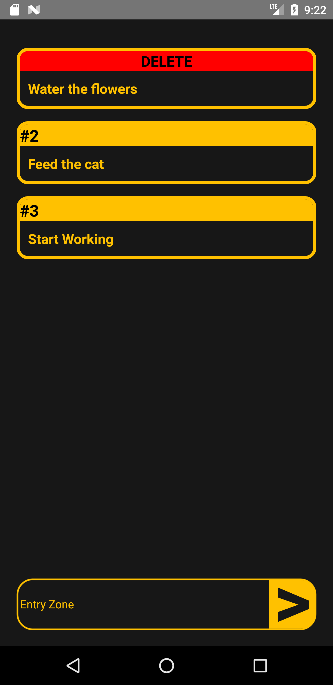

<h2> A simple To-Do App with React Native </h2>

It stocks data inside context and pushes as cards with a list.

You can see the delete button by pressing long on the to-do card and it deletes the card you choose by pressing delete.

  
<h3>Screenshots</h3>

